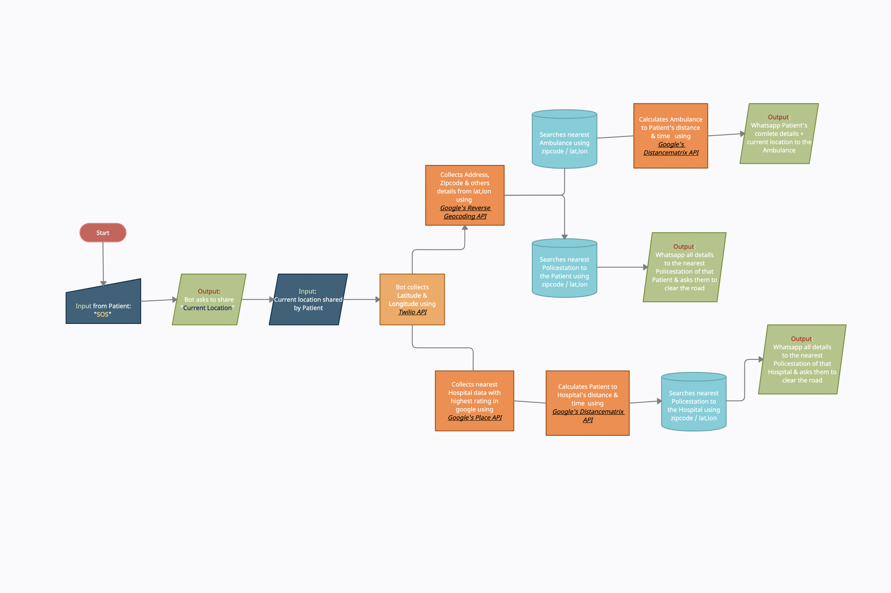

# WhatsApp Emergency Health Assistant
A WhatsApp-based chatbot developed for the IAHD Lifestyle Hackathon, designed to streamline access to critical health services.

In emergencies, searching for ambulances or hospitals online can be challenging and time-consuming. Recognizing that most people already have WhatsApp installed, we've created a bot that can quickly arrange ambulance services through this widely-used platform. 

Our solution eliminates the need to download additional apps or navigate complex websites during high-stress situations, providing rapid access to life-saving services through a familiar interface.

## Demo Video
https://github.com/whitelll3/iahd-ambulance/blob/d2f821d8d0db9d70aaf38bab7d6cf52781fa4af0/presentation.mp4
### Flow Chart

## Inspiration : 
Statistics from NIEM reveal a sobering reality: approximately 20% of patient fatalities are attributed to traffic delays. In 2016 alone, road accidents claimed 140,000 lives, with nearly 30% of these deaths resulting from delayed ambulance arrival.

To address this critical issue, our team has developed a WhatsApp-based solution. This innovative bot provides users with instant access to essential emergency services, including:

- Ambulance dispatch
- Hospital contact information
- Nearby police station details

By leveraging the ubiquity of WhatsApp, our bot aims to significantly reduce response times and potentially save lives in emergency situations.

## How Our Emergency Response Bot Works:
1. Location-Based Ambulance Dispatch
   - User shares their current location via WhatsApp
   - Bot identifies and contacts the nearest available ambulance
   - Patient's details and live location are securely transmitted to the ambulance service

2. Optimal Hospital Selection
   - Locates the nearest highly-rated hospital within a specified radius
   - Sends hospital information to both the ambulance and the patient
   - Provides a single WhatsApp message with:
     - Hospital location
     - Distance from patient
     - Estimated arrival time

3. Traffic Management for Emergency Routes
   - Identifies police stations nearest to:
     a) The patient's location
     b) The selected hospital
   - Alerts these stations to clear potential traffic between:
     - Ambulance's current location and patient
     - Patient's location and the hospital
   - Shares critical information with police:
     - Ambulance details (including number plate)
     - Pick-up and drop-off locations

This streamlined process ensures rapid response and coordination between all emergency services, potentially reducing critical response times.

## Technology Stack

Our emergency response bot is built on a robust foundation of modern technologies:

- Backend Framework: Flask
- Messaging Integration: Twilio
- Geolocation Services: 
  - Google Reverse Geocoding API
  - Google Places API
  - Google Distance Matrix API
- Data Processing: pandas (for CSV handling)

This combination of tools allows for efficient location-based services, real-time communication, and rapid data analysis, enabling our bot to provide critical emergency assistance quickly and accurately.

## Setup Guide

1. Install Required Packages:
2. Twilio Setup:
- Sign up at [Twilio](www.twilio.com/referral/Njt8YO)
- Navigate to: Develop > Messaging > Try it out > Send a WhatsApp message
- Send activation code to +14155238886

3. Google API Configuration:
- Access [Google Cloud Console](https://console.cloud.google.com/apis/dashboard)
- Create a new project
- Set up billing (verification required)
- Enable and copy API keys for:
  - Geocoding API
  - Places API
  - Distance Matrix API

4. Local Tunnel Setup:
- Download [ngrok](https://ngrok.com/download)
- Unzip and navigate to the file location in terminal
- Run: `./ngrok http 5000`
- Copy the generated forwarding URLs

5. Twilio Webhook Configuration:
- In Twilio console, set webhooks:
  - "When A Message Comes In" URL: [First ngrok URL]
  - "Status Callback URL": [Second ngrok URL]

With these steps completed, your local environment should be ready to run the emergency response bot.